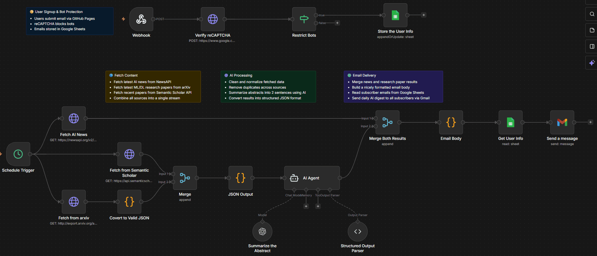
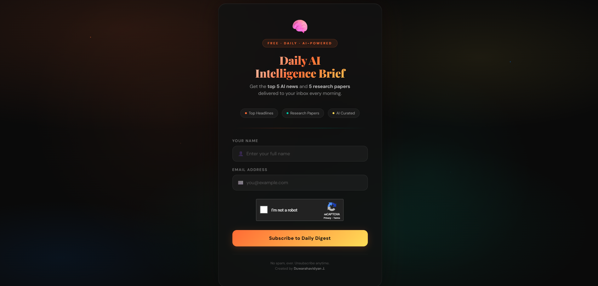
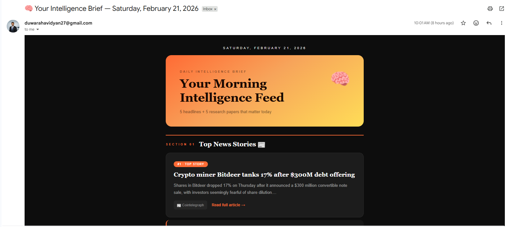
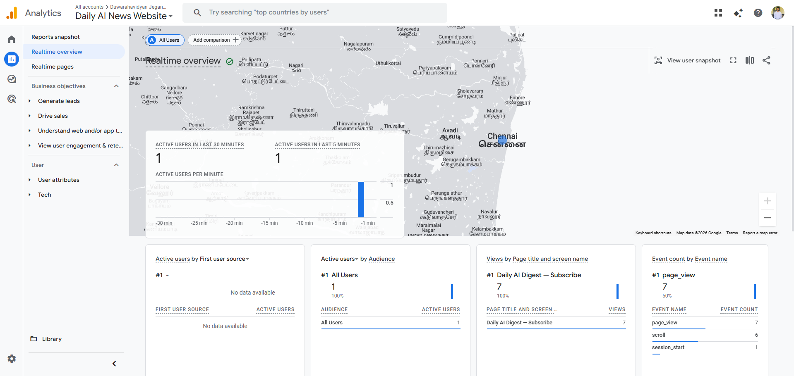

<!-- ============================================================ -->
<!-- PROJECT HEADER -->
<!-- ============================================================ -->

<h1 align="center">
  &nbsp;
  &nbsp;
  
  <br><br>
  🧠 <span>Daily AI Intelligence Digest — Automated Newsletter System</span> 📬
</h1>

<h3 align="center">🤖 An end-to-end automated AI news & research digest delivered daily at 10:00 AM</h3>

<p align="center">
  <em>A fully automated pipeline that curates the top 5 AI news headlines and 5 cutting-edge research papers, formats them into a beautifully designed email, and delivers them to subscribers every morning, all powered by n8n workflow automation.</em>
</p>

<p align="center">
  
  
  
  
  
  
  
</p>

<p align="center">
  <a href="https://bit.ly/4tO4dce"></a>
</p>

---

## ⚡ Introduction

Staying current with AI advancements is overwhelming — hundreds of news articles, research papers, and breakthroughs are published every single day. **Daily AI Intelligence Digest** solves this by delivering a curated, beautifully formatted summary straight to your inbox every morning at **10:00 AM**.

This project combines:

- 🌐 **A React subscription webpage** — for users to sign up with their name and email
- 🔄 **n8n workflow automation** — orchestrating data fetching, AI summarization, and email delivery
- 📰 **News API integration** — pulling the latest AI headlines from top sources
- 📄 **Research paper aggregation** — surfacing the most relevant papers from arXiv and other sources
- 🤖 **AI-powered summarization** — using LLMs to generate concise paper summaries
- 📧 **Automated email formatting & delivery** — a dark-themed, professionally designed HTML email

> **🔔 Subscribe here:** **[https://bit.ly/4tO4dce](https://bit.ly/4tO4dce)** 

---

## 🎬 Architecture

<p align="center">
  
</p>

<p align="center"><em>The complete automated flow: from n8n workflow execution to email delivery</em></p>

---

## 🌐 Subscription Webpage

Users subscribe through a sleek, dark-themed React + Vite single-page application deployed on GitHub Pages. The page features animated gradient backgrounds, floating particles, and a glassmorphism card design.

<p align="center">
  
</p>


**How it works:**

1. User fills in their **name** and **email**
2. Completes the **Google reCAPTCHA** verification
3. Form data is sent via `POST` to the **n8n webhook** (`application/x-www-form-urlencoded`)
4. n8n receives the subscriber data and stores it in the mailing list
5. User sees a **success confirmation** screen

---

## 🔄 n8n Workflow — The Automation Engine

The entire backend is powered by an **n8n workflow** running on n8n Cloud. No custom server, no database management, just a visual workflow that handles everything.

### Workflow Architecture

```
┌─────────────┐     ┌──────────────┐     ┌──────────────────┐
│  Cron Timer  │────▶│   News API   │────▶│  Top 5 AI News   │
│ (Daily 10AM) │     │   Fetch      │     │  Headlines       │
└─────────────┘     └──────────────┘     └────────┬─────────┘
                                                   │
                    ┌──────────────┐     ┌──────────▼─────────┐
                    │ arXiv / Paper│────▶│  Top 5 Research    │
                    │ Sources      │     │  Papers            │
                    └──────────────┘     └────────┬───────────┘
                                                   │
                    ┌──────────────┐     ┌──────────▼─────────┐
                    │  LLM / AI    │────▶│  Summarize Papers  │
                    │  Summarizer  │     │  (Short Summaries) │
                    └──────────────┘     └────────┬───────────┘
                                                   │
                    ┌──────────────┐     ┌──────────▼─────────┐
                    │  HTML Email  │────▶│  Format & Compose  │
                    │  Builder (JS)│     │  Dark-themed Email │
                    └──────────────┘     └────────┬───────────┘
                                                   │
                    ┌──────────────┐     ┌──────────▼─────────┐
                    │  SMTP / Email│────▶│  Send to All       │
                    │  Service     │     │  Subscribers       │
                    └──────────────┘     └────────────────────┘
```

### Workflow Steps

| Step | Node                        | Description                                                                              |
| ---- | --------------------------- | ---------------------------------------------------------------------------------------- |
| 1    | **Cron Trigger**            | Fires every day at **10:00 AM** to start the pipeline                                    |
| 2    | **HTTP Request (News API)** | Fetches the latest AI-related news articles from News API                                |
| 3    | **HTTP Request (Papers)**   | Fetches recent AI/ML research papers from arXiv and other sources                        |
| 4    | **AI Summarizer**           | Uses an LLM to generate concise summaries for each research paper                        |
| 5    | **JavaScript Code Node**    | Combines news + papers into a professionally designed HTML email with dark theme styling |
| 6    | **Subscriber List**         | Retrieves all subscribed email addresses                                                 |
| 7    | **Send Email**              | Delivers the formatted digest to every subscriber via SMTP                               |


The webhook validates the reCAPTCHA token and adds the subscriber to the mailing list.

---

## 📧 Email Design


<p align="center">
  
</p>


---

## 📊 Google Analytics

The subscription webpage is instrumented with **Google Analytics 4.** 

<p align="center">
  
</p>

- **Page views** and visitor traffic
- **User engagement** metrics (time on page, scroll depth)
- **Conversion tracking** for successful form submissions
- **Geographic distribution** of subscribers
- **Device and browser** analytics

---

## 🛠️ Tech Stack

| Layer               | Technology                                        | Purpose                         |
| ------------------- | ------------------------------------------------- | ------------------------------- |
| **Frontend**        | React 19 + Vite 7                                 | Subscription webpage            |
| **Bot Protection**  | Google reCAPTCHA v2                               | Prevent spam subscriptions      |
| **Analytics**       | Google Analytics 4                                | Visitor and conversion tracking |
| **Automation**      | n8n (Cloud)                                       | Workflow orchestration          |
| **News Source**     | News API                                          | AI headlines                    |
| **Papers Source**   | arXiv + external sources                          | Research papers                 |
| **AI Processing**   | LLM (via n8n AI nodes)                            | Paper summarization             |
| **Email Delivery**  | SMTP (via n8n)                                    | Sending to subscribers          |

---

## 🔐 Security

- **reCAPTCHA v2** protects the subscription form from bots and spam
- **Webhook validation** on the n8n side verifies the reCAPTCHA token before adding subscribers
- **No sensitive keys** are exposed — the reCAPTCHA site key is a public key by design; the secret key is stored securely in n8n

---

## 📬 Subscribe

Get your daily AI intelligence brief delivered every morning at **10:00 AM**.

<p align="center">
  <a href="https://bit.ly/4tO4dce"><strong>👉 Subscribe Now — It's Free</strong></a>
</p>

**What you'll receive:**

- 📰 **Top 5 AI news headlines** from major tech publications
- 📄 **Top 5 research papers** with AI-generated summaries, authors, and direct PDF links
- 🎨 **Beautifully formatted** dark-themed email — easy to scan, pleasant to read

---

## 📄 License

This project is licensed under the MIT License — feel free to use, modify, and distribute for educational and personal purposes.

---

## 👤 Author

**Duwarahavidyan J.**

---

<h4 align="center">🧠 Curating the AI frontier — so you don't have to 📬</h4>

<p align="center">
  
  &nbsp;
  
  &nbsp;
  
</p>

---

<p align="center">
  Made with ❤️ by Duwarahavidyan J.
</p>
